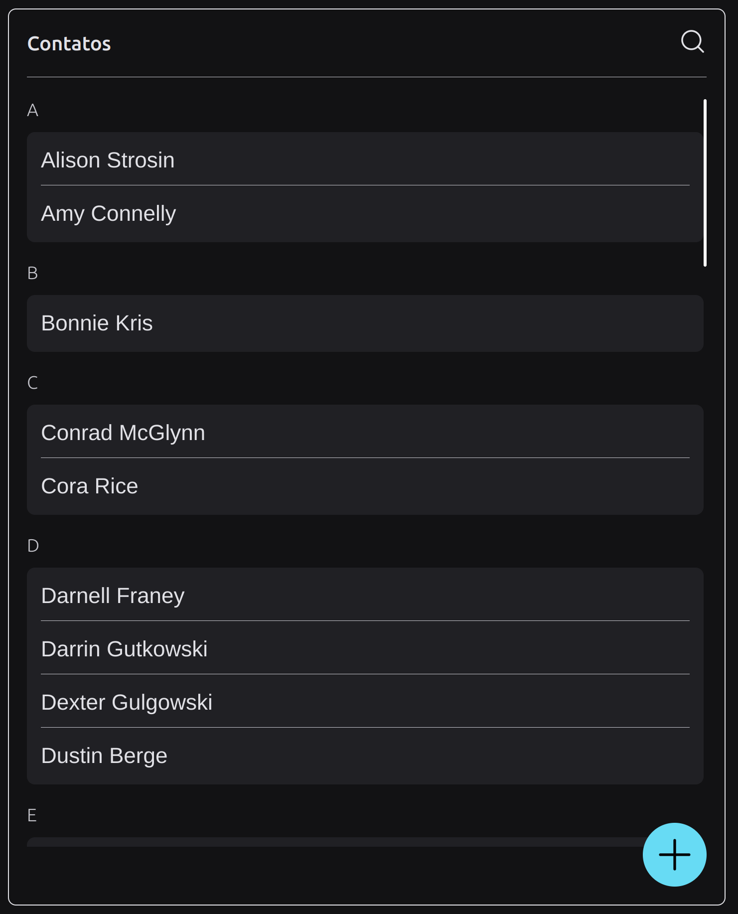

<p align="center">
  
</p>

<p align="center">
  <a href="#-desafio">Desafio</a>&nbsp;&nbsp;&nbsp;|&nbsp;&nbsp;&nbsp;
  <a href="#-configuracoes">Configurações</a>&nbsp;&nbsp;&nbsp;|&nbsp;&nbsp;&nbsp;
  <a href="#-tecnologias">Tecnologias</a>&nbsp;&nbsp;&nbsp;|&nbsp;&nbsp;&nbsp;
  <a href="#memo-licença">Licença</a>
</p>

## 🚀 Desafio VExpenses

Proposta de um projeto de agenda de contatos, utilizando React com TypeScript e Styled Componentes. Todas as funcionalidades requisitadas foram completas nesse desafio:

- [X] CRUD de contatos
- [X] Busca e preenchimento automático do endereço pelo CEP (utilizando alguma API externa)
- [X] Agrupamento dos contatos (por categorias ou pelas iniciais do nome)
- [X] Busca de contatos com sugestão de pesquisa
- [X] Possibilidade de muitos endereços e telefones por contato
- [X] Validação dos formulários no frontend
- [X] Feedbacks para o usuário em ações realizadas
- [X] Responsividade (desktop e mobile)

---

## 💻 Configurações para rodar o projeto
1. Instale os seguintes plugins no seu editor de código. (Sugestão: VSCode)
 * [ESlint](https://eslint.org/)
 * [EditorConfig](https://editorconfig.org/)
 2. Instale o Node acima da versão 16 e o Yarn acima da versão 1.
 -	[Node (instalação passo-a-passo)](https://www.notion.so/Instalando-o-Node-js-d40fdabe8f0a491eb33b85da93d90a2f)
 -	[Yarn (instalação passo-a-passo)](https://www.notion.so/Instalando-o-Yarn-eca6a13be5b3467d8d2f7be15c60f322)
------------
### Rode os seguintes comando em ordem sequencial
**Instalação das dependências**
```
yarn
```

Para rodar o json-server:
```
yarn start:server
```
###  --> Abra um novo terminal <---

Para executar em modo de desenvolvimento:
```
yarn dev
```


------------


## 🚧 Tecnologias

- React
- TypeScript
- Styled Components

---

## 🎨 Layout:

Figma: https://www.figma.com/file/xiiwT6yYZFdusPEAoblCP3/Contact-Book?node-id=0%3A1&t=M5Bmq50ODB1K7dGV-1

---


## :memo: Licença

Esse projeto está sob a licença MIT. Veja o arquivo [LICENSE](LICENSE) para mais detalhes.

---

Feito com ♥ by joaoD3V


